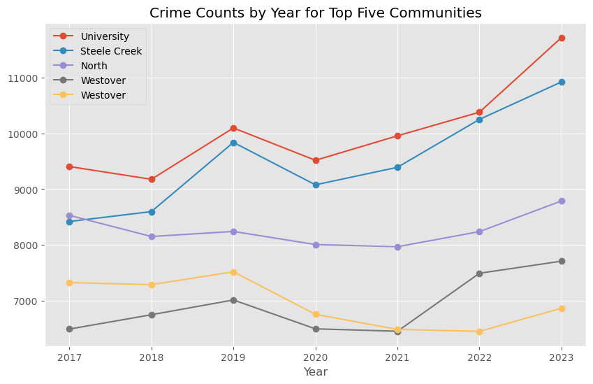
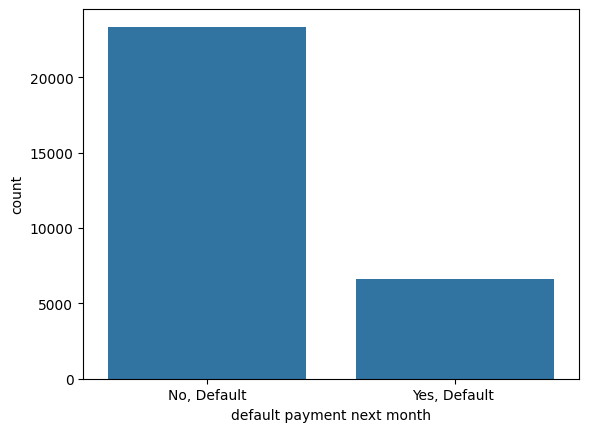
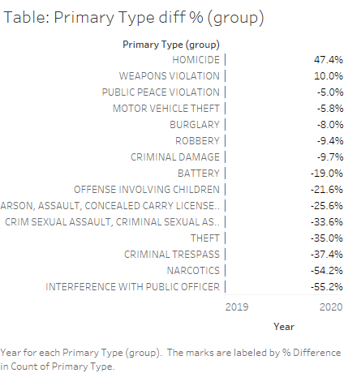

## Portfolio
### Group R and Python Projects
---
[Pokémon API ](https://pmb-7684.github.io/ST558_Project_2/)

A project that used resting APIs at [Poké Api.](https://pokeapi.co/) The vignette helps users on how to request information on their favorite Pokémon by name or ID from a resting API.  The information includes basic stats, training information, and moves.  There is an additional option to request information about berries.  Completed exploratory analysis with visualizations using data extracted from the api.

[Predictive Models for Online New Popularity Data Set](https://pmb-7684.github.io/ST558_Project_3/)

The purpose of this repository is to create predictive models and automating R Markdown reports. Analysis are completed on the Online News Popularity Data Set from UCI. Additional information about this data can be accessed [here](https://archive.ics.uci.edu/ml/datasets/Online+News+Popularity).

[Project 5 Recommender System ]()
Under construction - To be completed by December 12


### Individual Java, R, and Python Projects 
---

[Project 1 Charlotte's Neighborhood Crime Over Time - Data Exploration](https://pmb-7684.github.io/Data_Mining_Project_1/)

Crime is a concern for many urban areas in the United States, and Charlotte is no exception. It is important to understand crime patterns and statistics to help communities and law enforcement agencies develop plans, allocate resources, and engage with the community to improve public safety. The Charlotte-Mecklenburg Police Department (CMPD) regularly publishes detailed crime reports. As of July 22, 2024, overall crime in Charlotte has seen a slight increase of 1% compared to the previous year. This includes various types of crimes, categorized broadly into violent crimes and property crimes.  Acquired data from [CMPD Data Portal.](https://data.charlottenc.gov/datasets/charlotte::cmpd-incidents-1/about)

Explored how crime has evolved over time in different communities and how does location (such as open field, department store, hotel/motel, etc.) of the incident within neighborhoods effective crime? By determining communitites that are experiencing higher than normal levels of crime and specific location, the city, local law enforcement, and community can help allocated resources, develop plans and support community outreach to support all neighborhoods.




---
[Project 2 Default of Credit Card Clients - Classification](https://pmb-7684.github.io/Data_Mining_Classification_Project2/)

Default of Credit Card Clients data set is available from UC Irvine Machine Learning Repository. It is based on research paper written by Che-hui Lien Yeh in 2009 which examined default patterns of Taiwanese customers. The research compared the predictive accuracy of six data mining techniques. For their initial research, neutral network more accurately estimated the real probability of default.

For this classification project, used various classification models to predict if an individual would default on their next month's payment or not.  Default of Credit Card Clients data is located [here ](https://archive.ics.uci.edu/dataset/350/default+of+credit+card+clients)at UC Irvine Machine Learning Repository. 



---
[Project 3 Wave Farm - Regression](https://pmb-7684.github.io/Data_Mining_Regression_Project3/)

Fossil fuel can be a double-edged sword offering both positive and negative opportunities.  It can offer wealth to countries to fuel their economies and gasoline (plus byproducts) to offer mobility and comfort in the form of electricity for their citizens.  On the other hand, fossil fuel can be devastating to the environment if it is extracted incorrectly, and it is not an infinite resource.
A promising renewable energy resource is the use of wave farms to create energy.  The ocean covers 70% of the earth's surface.  It is also about 97% of all water on Earth.  The abundance of the oceans is a major reason to explore wave farming as an option for energy. The goal is to predict the total power output based on the coordination of the wave energy converters (WECs) within a large wave farm.  By demonstrating the benefits of wave energy maybe we can change a few minds to invest in wave energy.


---
[Project 4 Charlotte's Neighborhood Crime Over Time Through Cluster Analysis ](https://pmb-7684.github.io/Data_Mining_Clustering_Project_4/)

For this project, the data was explored through clustering analysis. Again, explored how crime has evolved over time in different communities. The difference is clustering was used to explore if certain neighborhood belongs to the same cluster. Acquired data from [CMPD Data Portal.](https://data.charlottenc.gov/datasets/charlotte::cmpd-incidents-1/about)


---
[The Right Conditions for COVID-19 (PDF)](/pdf/BAN Week 6 - Final Report_pmbailey.pdf)

Project focused on sixteen different universal conditions that could contribute to a person being infected with COVID-19.  The project completed in November 2020 as part of a capstone. World wide Coronavirus (COVID-19) data set which contained 50,350 observations and 41 variables. Used the programming language R to clean the data.

* Optimized linear, Lasso, Random Forest regressor, and other Machine learning techniques to determine the number of deaths from COVID-19 in 2020.
* Used Tableau to visualize important points in the data.
* Created a report addressing my question - why is a person infected with COVID-19? This question is based on if the following conditions contribute to being infected.  Those conditions were stringency index, population, population density, portion of the population over age 65, GDP per capita, extreme poverty, cardiovascular death rate, diabetes prevalence, smoker or not, number of hospitals, life expectancy and human development index. 


---
[Charlotte Mecklenburg Police Department - Shiny App]()

• Packages needed for installation.
```
install.packages(c("shiny", "shinydashboard", "shinythemes", "data.table", "tidyverse", "DT", "shinyWidgets", "caret", "randomForest", "rpart", "rattle", "rpart.plot", "RColorBrewer"))
```
• The shiny::runGitHub() code to run app in RStudio.

`shiny::runGitHub('shiny_CMPD', 'pmb-7684', ref = "main")`

ShinyApp is to analyze a portion of the Charlotte Mecklenburg Police Department (CMPD) crime data. The data is located at the City of Charlotte's [Open data portal](https://data.charlottenc.gov/).  The CMPD incidents are located [here](https://data.charlottenc.gov/datasets/cmpd-incidents-1/explore).  As of November 30, 2022, there were 542,153 observations with 25 variables (or features). 

The app contains an About page, a Data Exploration page which allows the user to select features (columns) and filter the rows of the data. The results are used to create categorical charts and summaries. This data set does not contain any numerical variables. This tab is divided into three sub tabs named Instructions, Data Selection, Visualization and Summary, a Modeling page that creates three supervised models - generalized linear regression model, classification tree, and a random forest model. This tab is divided into three sub tabs named Model Info, Model Fitting, and Prediction, and finally a Data page that allows the user to scroll through the data set and subset it by rows and columns. The user also has the ability to save the subsetted data as a .csv file, pdf, or as a copy.


---
[Project 4 - COVID-19 Effects on Crime in Chicago (PDF)](/pdf/Chicago- Final Project 08.16.2020 PMBailey.pdf)

Explored the effects of COVID-19 on the crime rate in Chicago, Illinois so far in 2020.  Chicago has been known for having a high crime rate especially murder rate.  In 2019, 492 individuals lost their lives and 567 were killed in 2018.  So, in 2020 was there a significant effect on crime in general due to the pandemic, social distancing, and state government mandates?"  

* Acquired data from the [City of Chicago portal](https://data.cityofchicago.org/Public-Safety/Crimes-2019/w98m-zvie)
* The data set contained over 260,000 observations and 22 variables. Compared the period from 01/01/2019 to 08/01/2019 (pre COVID-19) to 01/01/2020 to 08/01/2020 (beginning months of the pandemic).
* Acquired data from [data.gov](https://covid.cdc.gov/covid-data-tracker/#county-view?list_select_state=Illinois&data-type=CommunityLevels&list_select_county=17031) for the COVID cases in Chicago. Note: link to the original website is no longer active.  The web site above from the CDC provides similar information.
* Acquired geospatial data from the [portal](https://data.cityofchicago.org/Public-Safety/Boundaries-Police-Districts-current-/fthy-xz3r) as well.



---
[Project 5 - Crime in Chicago and Being Arrested: Project Overview](/pdf/Course Project Phase2.pdf)

Used machine learning techniques to predict the likelihood that a person would be "Arrested". Data set comes from the City of Chicago’s Data Portal and contains information about crime in Chicago in 2018. Models were built to predict the likelihood that a person would be Arrested."  We reduced the size of the dataset by sampling 15,000 observations from the original dataset, which contained 267,000 observations.  
  
* Optimized Classification tree, Logistic regression, Stacking, Random Forest, K-fold regression, and Regression with stepwise (Backwards and Forward). Three were discussed in this presentation: Classification, Logistic regression, and Stacking.


---
<p style="font-size:11px">Page template forked from <a href="https://github.com/evanca/quick-portfolio">evanca</a></p>
<!-- Remove above link if you don't want to attibute -->
